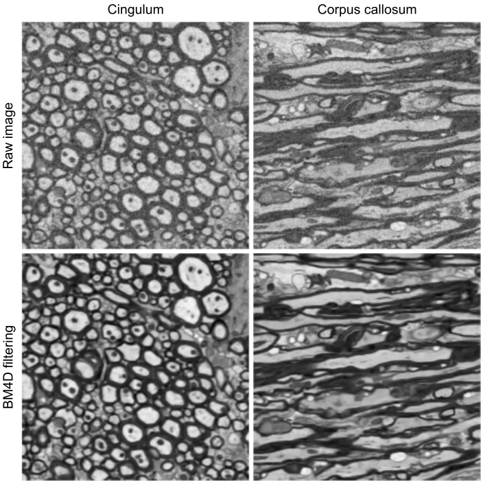
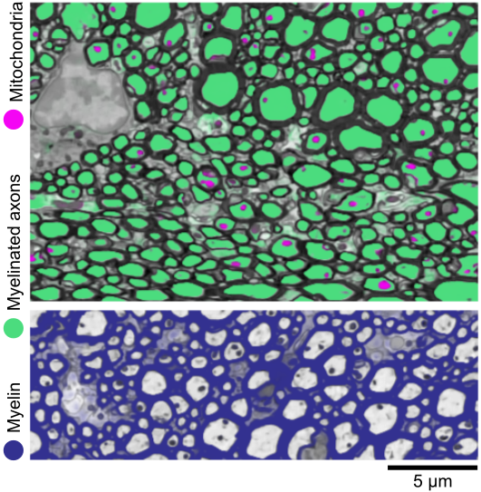

# DeepACSON
Automated Segmentation of White Matter in 3D Electron Microscopy

DeepACSON was developed by Ali Abdollahzadeh at the University of Eastern Finland to trace the entirety of myelinated axons in low-resolution, large field-of-view, 3D electron microscopy images of white matter.

A. Abdollahzadeh, I. Belevich, E. Jokitalo, A. Sierra, J. Tohka, DeepACSON: Automated Segmentation of White Matter in 3D Electron Microscopy, bioRxivdoi:https://doi.org/10.1101/828541.

A. Abdollahzadeh, A. Sierra, J. Tohka, Cylindrical shape decomposition for 3D segmentation of tubular objects, arXiv:1911.00571v2 [cs.CV] (2019). 
URL http://arxiv.org/abs/1911.00571.

## BM4D denoising
We used the BM4D filter to denoise 3D-electron microscopy images: one can download BM4D v3.2 from https://www.cs.tut.fi/~foi/GCF-BM3D/.




## Training and inference
Install Elktronn as instructed in https://github.com/ELEKTRONN. The network can be trained with the train.py script, which expects .h5 files as training materials. Use the inference.py script for the semantic segmentation of ultrastructures.



## Instance segmentation
The cylindrical shape decomposition algorithm is currently supported for Python 2 and requires NumPy, SciPy, Scikit-image, and scikit-fmm.

Due to the size of datasets, we provided examples as 3d-coordinates and their corresponding bounding box in dict files: 'objSz', 'objVoxInx'.

The mAxon_mError file is an example of an under-segmentation error, where two myelinated axons incorrectly were merged. The bounding box of this 3D object is 2004x1243x180, acquired at 50 nm x 50 nm x 50 nm resolution. To retrieve an object, load the coordinates as:

```python
import numpy as np

fn = './example/mAxon_mError.npz'
data = np.load(fn)

obj_sz = data['objSz']
obj_voxInd = data['objVoxInx']
bw = np.zeros(obj_sz, dtype=np.uint8)
for ii in obj_voxInd: bw[tuple(ii)]=1 
```

### Skeletonization
To skeletonize a 3D voxel-based object, we implemented the method from Hassouna & Farag (CVPR 2005); the method detects ridges in the distance field of the object surface. If you use skeleton3D in your research, please cite:

M. Hassouna and A. Farag, Robust centerline extraction framework using level sets, DOI 10.1109/CVPR.2005.306

A. Abdollahzadeh, A. Sierra, J. Tohka, Cylindrical shape decomposition for 3D segmentation of tubular objects, arXiv:1911.00571v2 [cs.CV] (2019). 
URL http://arxiv.org/abs/1911.00571.

Our implementation only requires:
- numpy>=1.0.2 
- scikit-fmm

```python
from skeleton3D import skeleton
skel = skeleton(bw)
```
You can modify the code to define the shortest path either as

- Euler shortest path: sub-voxel precise 
- discrete shortest path: more robust but voxel precise

and also to exclude branches shorter than *length_threshold* value.

With the default values, one should be able to reproduce the results in ./results/skeleton_mAx.npy. The skeletonization of the example object, 2004x1243x180 voxels, takes about 9 mins on a machine with 2xIntel Xeon E5 2630 CPU 2.4 GHz with 512 GB RAM. 

### Cylindrical shape decomposition
To apply CSD on a 3D voxel-based object, given its skeleton as *skel*, we have:

```python
from shape_decomposition import object_analysis
decomposed_image, decomposed_skeleton = object_analysis(bw, skel)
```
decomposed_image is a list, which length is equal to the number of decomposition components. The bounding box for each component is equal to the bounding box of BW image, the input object. In ./results, we provided dec_obj1 and dec_obj2 for the mAxon_mError file with an under-segmentation error. Due to the size of datasets, we provided the decomposed objects as 3d-coordinates and their corresponding bounding box in dict files: 'objSz', 'objVoxInx'.

```python
import numpy as np

fn = './example/dec_obj1.npz'
data = np.load(fn)

obj_sz = data['objSz']
obj_voxInd = data['objVoxInx']
obj1 = np.zeros(obj_sz, dtype=np.uint8)
for ii in obj_voxInd: obj1[tuple(ii)]=1
```
The same holds for obj2. 

You can modify the code to define *H_th* value, which lies in the range [0, 1]. *H_th* is the similarity threshold between cross-sectional contours. Also, setting 'ub' and 'lb', where 'ub>lb' also modifies the zone of interest.

DeepACSON instance segmentation, i.e., the CSD algorithm, can be run for every 3D object, i.e., an axon, independently on a CPU core. Therefore, instance segmentation of *N* axons can be run in parallel, where *N* is the number of CPU cores assigned for the segmentation task.


